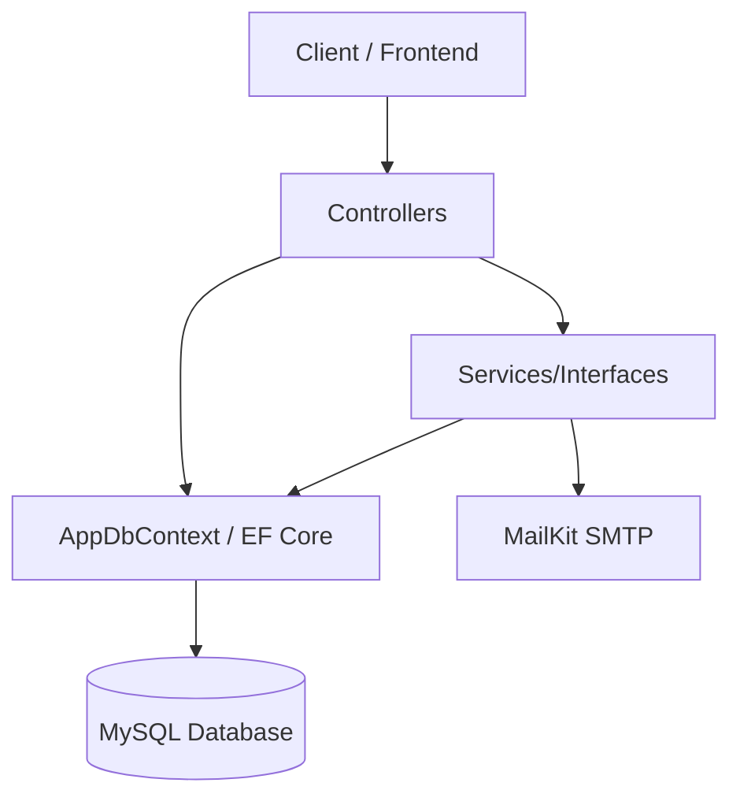

# AgiVys Backend - Documentação Técnica e Auditoria

## 1. Visão Geral

A **AgiVys API** é o backend responsável por fornecer os serviços do ecossistema AgiVys. É uma API RESTful projetada para a gestão de usuários, empresas, sistemas (AppSystems), menus e planos de acesso (SaaS multi-sistema).

## 2. Tecnologias

* **Framework:** .NET 8.0 (ASP.NET Core API)
* **Linguagem:** C# 12
* **Banco de Dados:** MySQL
* **ORM:** Entity Framework Core (Pomelo.EntityFrameworkCore.MySql v8.0.2)
* **Autenticação e Gestão de Usuários:** ASP.NET Core Identity (`Microsoft.AspNetCore.Identity.EntityFrameworkCore`) e JWT Bearer (`System.IdentityModel.Tokens.Jwt`)
* **Documentação de API:** Swagger (`Swashbuckle.AspNetCore`) com versionamento (`Asp.Versioning.Mvc.ApiExplorer`)
* **E-mail:** MailKit (SMTP)

## 3. Arquitetura

A arquitetura implementada no código é um **Monolito Orientado a MVC (sem Views)**.

Embora exista uma separação em pastas como `Controllers`, `Services`, `Models`, e `Interfaces`, o projeto **não implementa Clean Architecture ou Onion Architecture de forma estrita**. Grande parte da lógica de negócio, acoplamento ao Entity Framework Core (via `AppDbContext`), e mapeamentos manuais estão contidos nos **Controllers** (Fat Controllers).

### Diagrama de Arquitetura Real



## 4. Estrutura do Projeto

* `Configuration/`: Scripts iniciais, como o seed de Roles (`RoleSeeder`).
* `Controllers/`: Endpoints organizados por áreas (Authentication, Address, Company, Configuration, Checks, Person, RLS, UserAccessMap).
* `Data/`: Contexto do Entity Framework (`AppDbContext`).
* `DTOs/`: Data Transfer Objects para entrada e saída de dados.
* `Interfaces/`: Contratos de injeção de dependência (ex: `IEmailService`).
* `Models/`: Entidades de domínio mapeadas para o banco de dados.
* `Services/`: Serviços externos e de domínio (ex: `EmailService`, `UserAccessMapService`).
* `Migrations/`: Arquivos de versionamento do banco (Code-First).

## 5. Fluxo da Aplicação

1. **Request:** O cliente faz a chamada HTTP RESTful enviando o payload.
2. **Controller:** O endpoint no Controller correspondente é acionado, verifica validações do ModelState e as permissões de acesso (`[Authorize]`).
3. **Processamento:** 
   * Na maioria dos casos, o próprio Controller instancia, consulta e salva dados diretamente usando o `AppDbContext`.
   * Em alguns casos isolados, delega a lógica para um Serviço via Injeção de Dependência (`_userAccessMapService.AddUserAccessMapAsync`).
4. **Persistência:** Entity Framework executa queries e salva alterações no banco de dados.
5. **Response:** O Controller formata os resultados ou monta objetos anônimos/DTOs e os retorna via `Ok()`, `BadRequest()`, `NotFound()`, etc.

## 6. Autenticação e Autorização

* **Login:** Realizado no endpoint `/api/v1/authentication/login`. Utiliza o `UserManager` do Identity para validar e-mail e senha. 
* **JWT:** Gera um token JWT stateless com expiração de 4 horas, assinado via chave simétrica definida nas configurações. O token encapsula as claims `role`, `idSystem`, `email` e `name`.
* **Cookie HttpOnly:** Cria um cookie chamado `MedNext_Menu` (Secure, SameSite=None) para armazenar a árvore de permissões de menus codificada em Base64 para consumo imediato no frontend.
* **Roles/Policies:** A autorização nos Controllers utiliza Roles básicas do Identity (ex: `[Authorize(Roles = "Owner")]`, `[Authorize(Roles = "Admin, Dev")]`).
* **RLS (Role Level Security):** O gerenciamento estrutural de roles é restrito a administradores.

## 7. Banco de Dados

* **Tecnologia:** MySQL 8.
* **ORM:** EF Core com migrations Code-First.
* **Chave Primária e Relacionamentos:** O projeto adota `int` autoincremento (Identity) como chaves primárias. Possui configurações fluentes rigorosas (ex: `HasPrecision(18,2)`) em `AppDbContext.cs`.
* **Carga de Dados:** As consultas (Queries) utilizam frequentemente Eager Loading (`Include` e `ThenInclude`) sem `AsSplitQuery`, podendo resultar em queries complexas com Left Joins para coleções aninhadas.

## 8. Configuração e Variáveis de Ambiente

O projeto é configurado principalmente via `appsettings.json` e suas variações.

### Exemplo de Configuração (Placeholder)

```json
{
  "Logging": {
    "LogLevel": {
      "Default": "Information",
      "Microsoft.AspNetCore": "Warning"
    }
  },
  "AllowedHosts": "*",
  "ConnectionStrings": {
    "DefaultConnection": "Server=...;Port=...;Database=...;Uid=...;Pwd=...;Charset=utf8;SslMode=none;AllowPublicKeyRetrieval=True;"
  },
  "Jwt": {
    "Key": "[SUA_CHAVE_SUPER_SECRETA_COM_PELO_MENOS_32_CARACTERES]",
    "Issuer": "apiAgivys",
    "Audience": "apiAgivysUsers"
  }
}
```

## 9. Executando Localmente

### Pré-requisitos
* SDK do .NET 8.0
* Banco de dados MySQL (local ou docker)

### Passo a passo
1. Clone o repositório.
2. Atualize a `ConnectionStrings:DefaultConnection` e o `Jwt:Key` em `appsettings.Development.json` e `appsettings.json`.
3. Navegue até a pasta `AgivysSystem.Api`.
4. Restaure as dependências:
   ```bash
   dotnet restore
   ```
5. Aplique as migrations no banco:
   ```bash
   dotnet ef database update
   ```
6. Execute o projeto:
   ```bash
   dotnet run
   ```
7. Acesse a documentação no Swagger através da rota `/swagger`.

## 10. Endpoints Principais

A API é versionada por rota `/api/v1/`. Detalhes completos dos requests/responses podem ser vistos no Swagger em tempo de execução.

* **Authentication:** Cadastro genérico de sistemas (`register-system-user`), Login, Logout, Forgot/Reset Password, Token Validation.
* **Address:** Gestão de múltiplos endereços pessoais.
* **AppSystem (Sistemas):** Configuração de Sistemas Pai (AppSystems), Menus Dinâmicos, Submenus e Planos (comerciais).
* **Checks:** Consultas de pré-cadastro (disponibilidade de E-mail e CPF).
* **Company:** Gestão da estrutura empresarial multi-filial (Company, Endereços da Empresa).
* **Person:** Visualização e alteração dos dados cadastrais (Perfil).
* **RLS:** Módulo administrativo para gestão global de Regras do Identity (Roles).
* **UserAccessMap:** Gestão granular (ACL) de quem acessa quais Menus em um sistema.
* **Integration:** Cadastro de parâmetros e integrações de terceiros.

## 11. Tratamento de Erros

A API **não possui um Middleware Global** para gerenciamento de exceções ou retorno padronizado (`ProblemDetails`). 
Cada Controller implementa blocos genéricos de `try/catch` de forma manual e, frequentemente, expõe a string nativa do banco (`ex.InnerException.Message`) diretamente na resposta 500 ou 400.

## 12. Logs

Atualmente, não existe ferramenta de logging estruturado no projeto (como Serilog, NLog ou OpenTelemetry). O sistema utiliza apenas a saída padrão (`Console.WriteLine`) ou o `ILogger` padrão não interceptado de forma customizada. Não há traceamento (CorrelationId).

## 13. Testes

O repositório atual **não contém projetos de testes** (Unitários ou de Integração).

## 14. Docker e Deploy

* **Deploy Atual:** A aplicação roda na porta `5000` via Kestrel e utiliza Forwarded Headers (`XForwardedFor`, `XForwardedProto`) para lidar corretamente com proxy reverso (Nginx).
* A configuração do CORS permite estritamente os domínios em produção (`joederblanca.com.br`, `portaltheos.com.br`) e hosts locais.

## 15. Segurança e Problemas Conhecidos (Auditoria Técnica)

Os seguintes pontos foram identificados durante a análise técnica da aplicação e devem ser tratados conforme o roadmap:

* 🔴 **Segredos no Código Fonte:** Arquivo `appsettings.json` persistindo em histórico com strings de conexão de produção reais e chave de assinatura JWT real.
* 🟠 **Vazamento de Informações Sensíveis:** Exceções capturadas nos controllers retornam `ex.Message` e `ex.InnerException.Message`, o que pode revelar a estrutura interna e logs SQL para usuários finais (CWE-209).
* 🟠 **Mass Assignment & IDOR/BOLA:** 
  * A atribuição de empresas (`UserOwnerId`) em `CreateCompanyDto` aceita qualquer ID.
  * A delegação de acesso em `AddUserAccessMapAsync` checa apenas se quem faz a requisição possui a role "Owner", mas **não restringe ao sistema que este dono pertence**.
  * Endpoint de Person (`UpdatePerson`) altera o e-mail sem validação de dupla verificação, comprometendo a consistência do `UserManager`.
* 🟡 **Enumeração de Usuários (Checks):** Endpoints não-autenticados `/check-email` e `/check-cpf` confirmam se entidades existem na base de dados (Information Gathering).
* 🔵 **Tokens Ativos pós Logout:** O método de logout atual apenas remove o Cookie e não possui "Denylist" (Lista de revogação) para o token JWT, que possui validade longa de 4 horas.

## 16. Roadmap de Melhorias Futuras

1. **Correção Imediata de Secrets:** Rotacionar todas as senhas do BD de produção e Chaves JWT que estiveram no Git. Aplicar user secrets ou Variáveis de Ambiente.
2. **Correção de IDOR e Mass Assignment:** Remover a possibilidade de indicar proprietários no Request Body. O proprietário deve ser sempre deduzido pelo `ClaimTypes.NameIdentifier` extraído no Controller.
3. **Tratamento de Exceções Global:** Implementar um Middleware Global de `ExceptionHandling` que retorna o padrão `application/problem+json` RFC 7807, removendo mensagens diretas do EF Core.
4. **Refatoração para Services:** Remover queries do Entity Framework Core que residem dentro dos Controllers (como no `PersonController`, `AddressController` e `CompanyController`).
5. **Serilog e Cobertura de Testes:** Implementar logging estruturado persistente e criar testes de integração para fluxos críticos de autenticação.
