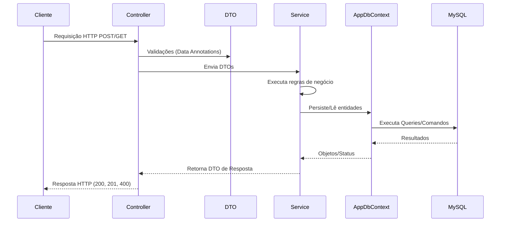

# Agivys API - Documentação Técnica Oficial

## 1. Visão Geral

A **Agivys API** é o backend responsável por fornecer os serviços do ecossistema Agivys, focado na gestão de empresas, usuários, sistemas (AppSystems) e processos financeiros. 

- **Objetivo:** Fornecer uma interface RESTful confiável para o frontend e outros clientes consumirem serviços de autenticação, configuração de sistemas, pagamentos e gestão de usuários/empresas.
- **Domínio de negócio:** SaaS, gestão multi-sistema, controle de acessos, assinaturas e faturamento.
- **Arquitetura:** Monolito em um único projeto (simplificada, orientada a domínios internos).
- **Tecnologias:** .NET 8.0 (Web API), MySQL, ASP.NET Core Identity, JWT, Entity Framework Core (Pomelo).

---

## 2. Arquitetura

O projeto não divide a arquitetura em múltiplos assemblies de solution (como em Clean Architecture padrão), mas sim através de uma separação lógica por **diretórios e namespaces** dentro do projeto `AgivysSystem.Api`. 

- **Camada de Apresentação:** `Controllers` - Expõe endpoints RESTful.
- **Camada de Aplicação/Domínio:** `Services` e `Models` - Contém a lógica de negócio e as regras do domínio.
- **Camada de Infraestrutura/Dados:** `Data` (EF Core) e `Services/External` - Acesso ao banco de dados e comunicação com APIs externas.

**Fluxo das requisições:**
1. A requisição HTTP chega ao **Controller**.
2. O Controller valida o modelo recebido via **DTO**.
3. O Controller chama a interface do **Service** injetado (via Injeção de Dependência).
4. O **Service** executa a regra de negócio e interage diretamente com o **AppDbContext** (Entity Framework).
5. O banco de dados MySQL processa a persistência.
6. O Service retorna o resultado/DTO para o Controller, que devolve o status HTTP apropriado.

**Injeção de Dependência:** Configurada no `Program.cs`. Serviços geralmente são injetados como `Scoped` para acompanhar o ciclo de vida da requisição HTTP.

---

## 3. Estrutura da Solution

Atualmente, a solução (`.sln`) centraliza o código no projeto principal:

* **AgivysSystem.Api:**
  * **Finalidade:** Concentrar todas as responsabilidades do backend.
  * **Responsabilidades:** Roteamento, validação, persistência e integrações.
  * **Dependências:** EF Core, Pomelo MySQL, MailKit, Identity.

---

## 4. Árvore completa de diretórios

A estrutura de diretórios foi pensada para manter a organização lógica:

```text
Solution
│
└── AgivysSystem.Api
    ├── Configuration/     # Classes de configuração de inicialização (ex: RoleSeeder)
    ├── Controllers/       # Endpoints expostos (agrupados por contexto: Auth, Company, etc.)
    ├── Data/              # Configurações do EF Core (AppDbContext)
    ├── DTOs/              # Objetos de entrada/saída de dados da API
    ├── Interfaces/        # Contratos para os Services, permitindo Inversão de Controle (IoC)
    ├── Migrations/        # Histórico de alterações do banco de dados (Code-First)
    ├── Models/            # Entidades do banco de dados (representação das tabelas)
    └── Services/          # Lógica de negócio e integrações externas (Email)
```

---

## 5. Fluxo da aplicação



---

## 6. Banco de Dados

O banco utilizado é o **MySQL**. O mapeamento é feito via **Entity Framework Core (Code-First)** através da classe `AppDbContext`.

### Principais Entidades e Relacionamentos:
* **User (IdentityUser):** Gestão de credenciais e roles. Relacionado a `Company` e `AppSystem`.
* **Person:** Dados físicos do usuário (Nome, Documento/CPF). Chave única no `Document`.
* **Company & CompanyAddress:** Gestão de empresas e seus múltiplos endereços. Chave única no `Cnpj`.
* **AppSystem, Plan, Menu, Submenu:** Estrutura dinâmica para montar o software e definir planos (assinaturas). Planos possuem relacionamento N:N com Menus e Submenus (tabelas `PlanMenus`, `PlanSubmenus`).
* **Order, OrderItem:** Gestão de faturamento e pedidos. Precisão decimal (18, 2) garantida no `OnModelCreating`.
* **UserAccessMap:** Mapeamento de controle de acessos a níveis granulares.

---

## 7. Endpoints

Os endpoints estão prefixados com a versão `/api/v1/` e agrupados nos seguintes Controllers:

### AuthController
* `POST /api/v1/auth/register` - Cadastro de usuário padrão. Requer `idSystem`.
* `POST /api/v1/auth/register-system-user` - Cadastro de usuário do sistema.
* `POST /api/v1/auth/login` - Retorna token JWT e dados do usuário/pessoa.
* `POST /api/v1/auth/logout` - Logout.
* `POST /api/v1/auth/forgot-password` / `reset-password` - Fluxo de recuperação de senha.
* `GET/POST/PUT/DELETE /api/v1/auth/my-addresses` - Gestão de endereços do usuário logado.
* `GET /api/v1/auth/check-email/{email}` / `check-cpf/{document}` - Validações em tempo real.

### CompanyController
* `POST /api/v1/company/create-with-address` - Cria empresa + endereço em transação.
* `GET /api/v1/company/owner/{userId}` - Lista empresa do usuário.
* `GET/POST/PUT/DELETE /api/v1/company/{companyId}/addresses` - Gestão de endereços empresariais.

### ConfigurationController
* `POST/GET/PUT/DELETE /api/v1/configuration/menus` - CRUD de menus dinâmicos.
* `POST/GET/PUT/DELETE /api/v1/configuration/plans` - CRUD de planos de sistema.


### UserAccessMapController
* Endpoints para gerenciar mapeamento de sessões e acessos a módulos.

---

## 8. Regras de Negócio

* **Multi-sistema (idSystem):** Um mesmo banco suporta múltiplos sistemas frontend. Os usuários e permissões são particionados logicamente com base na relação N:N de `UserSystem`. O JWT pode possuir múltiplas claims `idSystem` caso o usuário pertença a mais de um sistema.
* **Autenticação:** O payload do JWT injeta a role para validar requisições via `[Authorize]`. O JWT possui expiração rigorosa.
* **Faturamento:** Os cálculos de `TotalValue` garantem precisão financeira para pedidos.

---

## 9. Segurança

* **Autenticação JWT:** Validação do Issuer, Expiração e Chave simétrica. Stateless.
* **ASP.NET Core Identity:** Gestão de hash de senhas e políticas de complexidade (mínimo 6 caracteres, exige dígitos).
* **Autorização (Roles):** Utilização das Claims Identity `role` para acessar recursos administrativos.
* **CORS:** Restrito para domínios específicos em produção (`http://localhost:4200` e `https://joederblanca.com.br`).

---

## 10. Configurações

O arquivo `appsettings.json` controla o ambiente:

* `ConnectionStrings:DefaultConnection` - Obrigatório.
* `Jwt:Key`, `Jwt:Issuer`, `Jwt:Audience` - Obrigatório para segurança e criptografia de tokens.
* `EmailSettings` - Credenciais para MailKit (SMTP, API Key).

---

## 11. Dependências externas

* **MailKit / SMTP:** Para envio de e-mails transacionais (como recuperação de senhas).
* **Pomelo.EntityFrameworkCore.MySql:** Provider do EF Core para comunicar com o MySQL.

---

## 12. Convenções do projeto

* **Nomenclatura:** Endpoints com `LowercaseUrls = true`, Controllers com sufixo `Controller`, Services com sufixo `Service`.
* **Services:** Extração da lógica dos Controllers para classes injetadas via construtor com contrato de `Interfaces` (ex: `IEmailService`, `IUserAccessMapService`).
* **Entity Framework Core:** Uso extensivo de Data Annotations nos `Models` mas com configurações avançadas (índices, Foreign Keys) fluentes dentro do `OnModelCreating` em `AppDbContext`.
* **Resultados HTTP:** Respostas padronizadas com 200 (Sucesso), 400 (Regra de Negócio/Validação), 404 (Não Encontrado).

---

## 13. Fluxos importantes

### Fluxo de Autenticação
1. O Front envia `email` e `senha` para `/api/v1/auth/login`.
2. O sistema verifica com o `UserManager` do Identity. Se a senha for válida, as claims e roles são carregadas.
3. É gerado o JWT contendo ID do sistema, empresa, e claims. Retornado em JSON junto a dados da Pessoa (`Person`).

---

## 14. Pontos de atenção

* **Débitos técnicos:** Ausência de uma camada isolada de repositórios (Repository Pattern) causa acoplamento direto dos Services ao EF Core `AppDbContext`. Isso dificulta mocks isolados para testes unitários.
* **Testes:** Atualmente o projeto não conta com projetos de testes automatizados (`.Tests` não visível). Isso é um risco ao escalar.
* **Logs Estruturados:** A API usa Logs de Console simples, o que dificulta o rastreamento em produção (Recomenda-se adoção de Serilog com Sink para Elastic ou Seq).

---

## 15. Guia para futuros desenvolvedores

* **Onde adicionar novos endpoints:** Crie ou atualize arquivos dentro da pasta `Controllers/`. Use sempre versão e o atributo `[ApiController]`.
* **Onde adicionar novas regras de negócio:** Crie a classe em `Services/`, implemente a interface em `Interfaces/` e registre a Injeção de Dependência em `Program.cs` (`builder.Services.AddScoped<...>`).
* **Onde adicionar novas entidades:** 
  1. Crie o arquivo em `Models/`.
  2. Adicione o `DbSet<T>` no `Data/AppDbContext.cs`.
  3. Execute o comando `dotnet ef migrations add NomeDaMigration`.
  4. Rode `dotnet ef database update`.

---

## 16. Contexto para Agentes de IA

Esta seção foi criada para fornecer o contexto rápido para qualquer LLM/IA que for dar manutenção no código.

### Visão Geral (IA Context)
- **Estrutura:** Monolito MVC sem view (Apenas API). As regras moram em `Services/`, DB Mapping em `Data/AppDbContext.cs`, DTOs em `DTOs/` e Rotas em `Controllers/`.
- **Framework:** .NET 8.0, C#, Pomelo EF Core MySQL.
- **Autenticação:** Baseado no ASP.NET Identity + JWT (Claims com `role` e múltiplas de `idSystem`).

### Principais Entidades e Lógica
- As instâncias são muitas vezes isoladas por `idSystem`, permitindo acesso multi-sistema aos usuários.
- `Models/User/User` e `Models/People/Person` gerenciam o acesso humano.
- `Models/Configuration/AppSystem` contém Menus, Submenus e Planos.

### Convenções Obrigatórias
- **NÃO VAZAR ENTIDADES:** Sempre transite `DTOs` nos retornos dos Controllers, NUNCA as entidades nativas do Entity Framework.
- **Injeção de Dependência:** Todo novo service PRECISA ser registrado em `Program.cs`. Preferencialmente como `Scoped`.
- **Validação:** Deixe validações básicas no modelo DTO (Data Annotations) e regras de negócio nos `Services`.

### Checklist para Novas Funcionalidades
1. [ ] Criar a Entidade (`Models/`).
2. [ ] Adicionar ao DbContext e rodar Migration.
3. [ ] Criar os `DTOs` de Request/Response correspondentes.
4. [ ] Criar Interface (`Interfaces/`) e implementar o Service (`Services/`).
5. [ ] Registrar o Service no DI (`Program.cs`).
6. [ ] Criar Controller expondo endpoints REST e mapeando via Injeção de Dependência o Service.

### Checklist de Revisão
- O método do controller não possui regras de negócio diretas?
- Foram retornados status HTTP condizentes? (200 OK, 400 Bad Request)
- As propriedades decimais de dinheiro estão mapeadas com `HasPrecision(18,2)` no `AppDbContext`?
- As chamadas externas possuem `try/catch` adequado?
